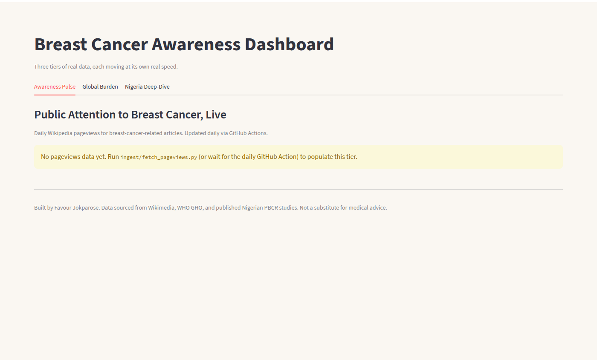
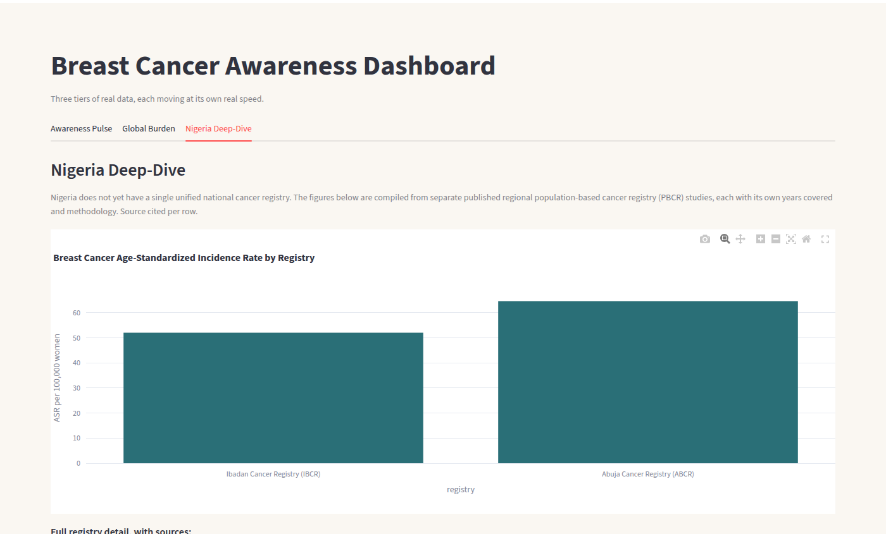
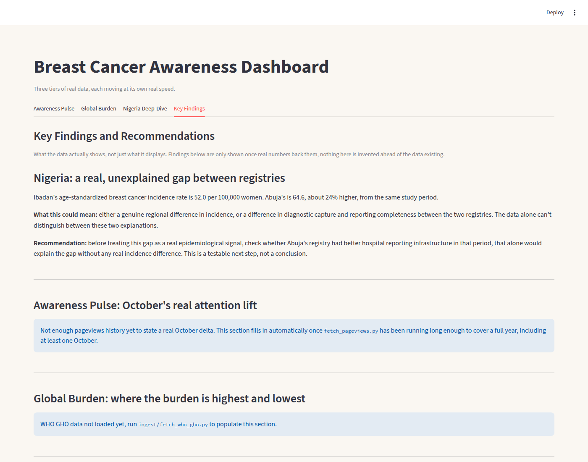

# Breast Cancer Surveillance & Health Informatics Observatory

A public-facing breast-cancer data storytelling project built by **Favour Jokparose**. The dashboard combines digital awareness trends, WHO country-level indicators, and published Nigerian population-based cancer registry evidence while clearly separating what the data shows from what it cannot prove.

> **Purpose:** make breast-cancer data understandable to people with different levels of data and health knowledge. This is an educational analytics project, not medical advice.

## Dashboard preview

### Awareness Trends


### Nigeria Deep-Dive


### Key Findings


## The story the dashboard tells

1. **Awareness Trends - What are people paying attention to?**  
   Daily Wikimedia pageviews are used as a proxy for public information-seeking. Pageviews are **not** breast-cancer cases, diagnoses, prevalence, or deaths.

2. **Global Disease Burden - What does WHO country-level data report?**  
   WHO Global Health Observatory indicators are presented with full country names, readable indicator names, units, year, population/sex group when available, and a plain-language guide explaining how to interpret the number. Numeric indicators use maps/rankings; Yes/No indicators use categorical summaries instead of meaningless numeric maps.

3. **Sub-National Registries (Nigeria) - What does published Nigerian evidence show?**  
   Regional PBCR evidence is kept regional. An ASR such as **64.6 per 100,000 women** means an estimated 64.6 new cases per 100,000 women after adjusting for population age structure; it does **not** mean 64.6% of women have breast cancer. A study case count, such as Edo-Benin's 205 cases, is labelled separately and is not directly compared with an incidence rate.

4. **Key Findings - What can responsibly be concluded?**  
   The final section separates findings, limitations, plausible explanations, and next analytical steps. It avoids turning correlation or regional differences into unsupported causal claims.

## Current data sources

| Layer | Source | Update pattern | What it represents |
|---|---|---|---|
| Awareness Trends | Wikimedia Pageviews REST API | Daily | Public attention / information-seeking proxy |
| Global Disease Burden | WHO Global Health Observatory | Source-dependent, generally periodic/annual | Country-level survival, mortality, DALYs, screening/service indicators |
| Nigeria Deep-Dive | Published PBCR studies | Static until new literature is added | Regional registry evidence, not a national Nigerian estimate |

## Beginner quick start

Open the project folder in VS Code, then open **Terminal > New Terminal** and run these commands one at a time:

```powershell
python --version
pip install -r requirements.txt
streamlit run dashboard.py
```

If you want to refresh the datasets:

```powershell
python ingest/fetch_pageviews.py
python ingest/fetch_who_gho.py
python ingest/nigeria_registry_data.py
streamlit run dashboard.py
```

A detailed beginner guide is included in the project documentation package delivered with this repository version.

## Automation

`.github/workflows/daily_pageviews.yml` runs the Wikimedia pageview ingestion each day at **06:00 UTC** and commits the updated history when data changes. The repository's GitHub Actions workflow permission must allow **Read and write permissions**, because the workflow needs to push the refreshed CSV.

## Technology

- Python
- Pandas
- Streamlit
- Plotly
- Requests
- Pycountry (ISO-3 country code -> full country name)
- GitHub Actions
- Streamlit Community Cloud

## Responsible AI disclosure

AI was used as a **coding and implementation assistant**, particularly for areas outside the project's core analytical focus such as application structure, debugging, automation, and parts of the Streamlit implementation. The project owner conducted the research, selected and reviewed the data sources, defined the analytical questions, validated outputs, interpreted the data, developed the key findings, and decided how the results should be communicated. AI-assisted code was tested rather than treated as automatically correct.

## Important interpretation notes

- Wikimedia pageviews measure attention, not disease burden.
- WHO indicators can have different years and population dimensions; the dashboard displays those distinctions rather than pretending all observations are directly comparable.
- `SEX_FMLE`, `SEX_MLE`, and `SEX_BTSX` are translated for users as **Female**, **Male**, and **Both sexes**.
- Country codes such as `NGA` are retained internally for mapping but displayed publicly as full names such as **Nigeria**.
- Nigeria PBCR values are regional evidence and should not be presented as a single national rate.
- This dashboard is not a substitute for medical advice, screening guidance, diagnosis, or treatment.

## Author

**Favour Jokparose**  
Data Analyst
